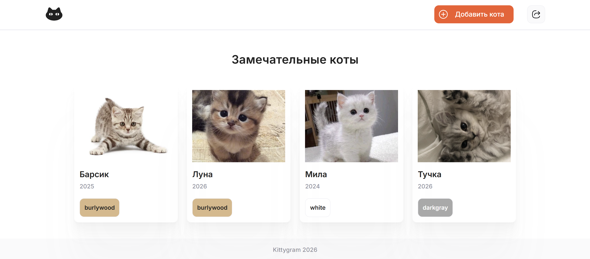

**English** | [Русский](README.ru.md)

# Kittygram Final

**Kittygram Final** is an educational Django + React application with PostgreSQL, Nginx, Docker Compose, and GitHub Actions.

Kittygram is a social network for sharing cat profiles. This repository primarily demonstrates the infrastructure of a full-stack application: containerization, production configuration, automated checks, and deployment workflows.

## Skills demonstrated

- containerizing the Django backend;
- containerizing the React frontend;
- a separate Nginx gateway;
- PostgreSQL in a separate container;
- volumes for the database, static files, and media;
- local and production Compose files;
- configuration through `.env`;
- Gunicorn for the backend;
- backend/frontend checks in GitHub Actions;
- Docker image build checks without production secrets;
- a separate manual production deployment over SSH;
- migrations and collectstatic in the deployment workflow;
- Telegram notification after a successful deployment.

## Tech stack

**Backend:** Python, Django, Django REST Framework, Djoser, PostgreSQL, Gunicorn  
**Frontend:** JavaScript, React 17, React Router  
**Infrastructure:** Docker, Docker Compose, Nginx, Docker Hub, GitHub Actions, SSH

## Architecture

```text
Client
  │
  ▼
Nginx gateway
  ├──► React static
  ├──► Django API / admin
  └──► media
          │
          ▼
      PostgreSQL
```

Containers:

| Service | Purpose |
| --- | --- |
| `backend` | Django API and admin |
| `frontend` | React SPA build |
| `gateway` | Nginx routing/static/media |
| `db` | PostgreSQL |

## Interface



## Structure

```text
kittygram_final/
├── backend/
├── frontend/
├── nginx/
├── .github/workflows/
│   ├── main.yml              # CI: tests + Docker build
│   └── deploy.yml            # manual production deployment
├── docker-compose.yml
├── docker-compose.production.yml
├── .env.example
└── README.md
```

## Local setup

```bash
git clone https://github.com/nikamurkaa/kittygram_final.git
cd kittygram_final
cp .env.example .env
docker compose up -d --build
```

Example local variables are provided in `.env.example`. For a real deployment, replace `SECRET_KEY`, the database password, `ALLOWED_HOSTS`, and `CSRF_TRUSTED_ORIGINS`.

Interface: http://localhost:9000/. Docker Engine/Desktop and Compose v2 are required.
In PowerShell, copy the template with `Copy-Item .env.example .env`.

After startup, apply migrations:

```bash
docker compose exec backend python manage.py migrate
```

Collect backend static files:

```bash
docker compose exec backend python manage.py collectstatic --noinput
```

Registration is available through the web interface. Create an administrator with:

```bash
docker compose exec backend python manage.py createsuperuser
```

Stop: `docker compose down` (data in volumes is retained).

## CI/CD

`.github/workflows/main.yml` runs on pushes and pull requests to `main`. It checks the backend, frontend, and all Docker image builds without requiring production SSH/Docker Hub secrets.

`.github/workflows/deploy.yml` is triggered manually through `workflow_dispatch`. It publishes Docker images and deploys over SSH only when the production environment is configured.

This separation keeps code quality checks independent of external server availability: an unavailable production host does not fail regular CI.

Deployment secrets are stored in GitHub Actions Secrets and must not be committed to repository files.

## Status

Completed as part of the **Yandex Practicum Python Developer course**, the project demonstrates Docker, Django deployment, PostgreSQL, Nginx, and CI/CD.

## Author

[Nicole Zhurbenko](https://github.com/nikamurkaa)
